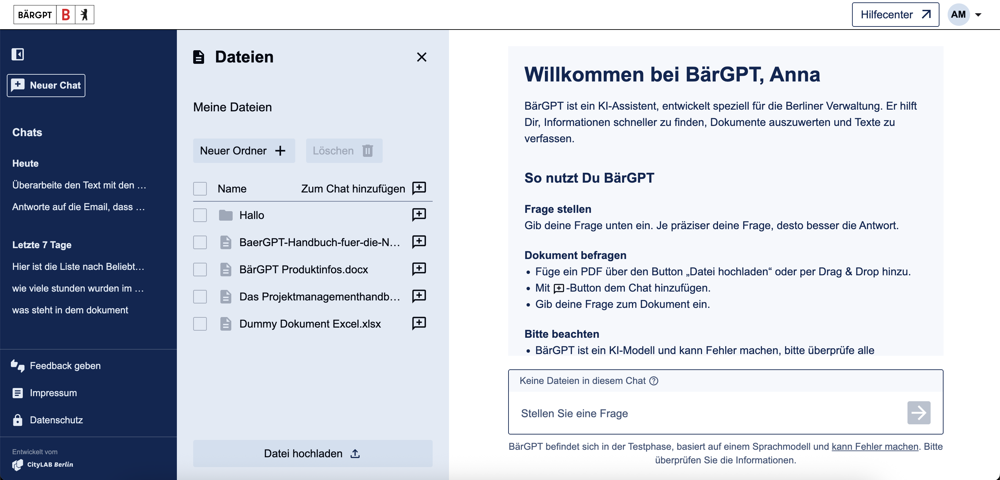

<!-- ALL-CONTRIBUTORS-BADGE:START - Do not remove or modify this section -->

<!-- ALL-CONTRIBUTORS-BADGE:END -->

# 

## About [_BärGPT_](https://www.baergpt.berlin)

BärGPT was launched by CityLAB Berlin and implemented in close cooperation with the Berlin Senate Chancellery. Prototypes were developed, tested and improved in an agile process together with employees from the administration. BärGPT relies on open source technology and is being developed in a transparent, data protection-compliant and user-centred manner – for modern, sovereign administrative digitisation.

#### How BärGPT supports Berlin's administration

BärGPT provides support with a free chat function that can be used flexibly – similar to well-known AI systems. This allows texts to be quickly created, revised, translated or summarised. The system also reliably answers general questions. Another key feature is intelligent document management: users can upload files, have them analysed automatically and search for specific content using the integrated RAG search – even in several documents at once.

BärGPT is an open source project by the [Technologiestiftung Berlin](https://www.technologiestiftung-berlin.de/) and the [CityLAB Berlin](https://citylab-berlin.org/de/start/).

## Repositories

This project is composed of one monorepo:

- [BärGPT](https://github.com/technologiestiftung/baergpt)

## Documentation

To setup BärGPT locally or in production, follow the development setup guide at [README_DEV.md](./README_DEV.md).

## Contributing

Before you create a pull request, write an issue so we can discuss your changes.

## Contributors

Thanks goes to these wonderful people ([emoji key](https://allcontributors.org/docs/en/emoji-key)):

<!-- ALL-CONTRIBUTORS-LIST:START - Do not remove or modify this section -->
<!-- prettier-ignore-start -->
<!-- markdownlint-disable -->
<table>
  <tr>
  </tr>
</table>

<!-- markdownlint-restore -->
<!-- prettier-ignore-end -->

<!-- ALL-CONTRIBUTORS-LIST:END -->

This project follows the [all-contributors](https://github.com/all-contributors/all-contributors) specification. Contributions of any kind welcome!

## Content Licensing

Texts and content available as [CC BY](https://creativecommons.org/licenses/by/3.0/de/).

Illustrations by {MARIA_MUSTERFRAU}, all rights reserved.

## Credits

<table>
  <tr>
    <td>
      Made by <a href="https://citylab-berlin.org/de/start/">
         
         
        
      </a>
    </td>
    <td>
      A project by <a href="https://www.technologiestiftung-berlin.de/">
         
         
        
      </a>
    </td>
    <td>
      Supported by <a href="https://www.berlin.de/rbmskzl/">
         
         
        
      </a>
    </td>
  </tr>
</table>
