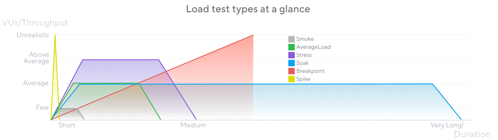

# K6 Load Testing Documentation

## What is K6?

K6 is an open-source load testing tool designed for testing the performance of APIs, microservices, and websites.
It's built for developers and DevOps engineers to catch performance issues.

⚠️Important: while tests are written in TypeScript, it runs in [Sobek](https://github.com/grafana/sobek) a JS/TS runtime written in **Go**.
Multiple features available in Nodejs/Deno/Bun are not available ⚠️

## Installation

### macOS (Homebrew)

```bash
brew install k6
```

## Running Tests

### Preparation

⚠️Important ⚠️

- some tests don't create everything they need by themselves:
  they require accounts, chats, documents to be existing before the test is executed.
- the tests are not cleaning up after themselves: you'll need to delete created entities manually.

### Running a basic test

```bash
k6 run script.ts
```

If you want to also see the results in a web dashboard
and save them to a html file, you can use:

```bash
K6_WEB_DASHBOARD=true K6_WEB_DASHBOARD_EXPORT=html-report.html k6 run script.ts
```

## Load Tests Types



### Smoke Testing

- Purpose: Verify the system works with minimal load
- Configuration: 1-2 VUs, very short duration / iterations
- Use Case: Validate functionality and gather baseline performance values.

### Average Load Testing

- Purpose: Test the system under typical expected load
- Configuration: Normal number of concurrent users, moderate duration (5-60 minutes)
- Use Case: Assess normal operating conditions

### Stress Testing

- Purpose: Test the system performs when loads are heavier than usual
- Configuration: Gradually increase load beyond average load
- Use Case: Assess higher load operating conditions and failure thresholds

### Spike Testing

- Purpose: Test system behavior under sudden traffic surges
- Configuration: Rapid increase to high load, then rapid decrease
- Use Case: Validate handling of sudden traffic spikes (e.g. flash sales)

### Soak Testing

- Purpose: Identify memory leaks and degradation over time
- Configuration: Average load over extended period (hours/days)
- Use Case: Find issues that only appear after prolonged operation

### Breakpoint Testing

- Purpose: Incrementally increase load until system breaks
- Configuration: Steady increase in VUs until failure
- Use Case: Discover absolute limits and bottlenecks

## Basic Test Structure

```typescript
import http from "k6/http";
import { check, sleep } from "k6";

export const options = {
	vus: 10,
	duration: "30s",
};

export default function () {
	const res = http.get("https://api.example.com");
	check(res, { "status is 200": (r) => r.status === 200 });
	sleep(1);
}
```

## Useful Resources

- [Official Documentation](https://grafana.com/docs/k6/latest/)
- [Test Guide](https://grafana.com/docs/k6/latest/testing-guides/)
